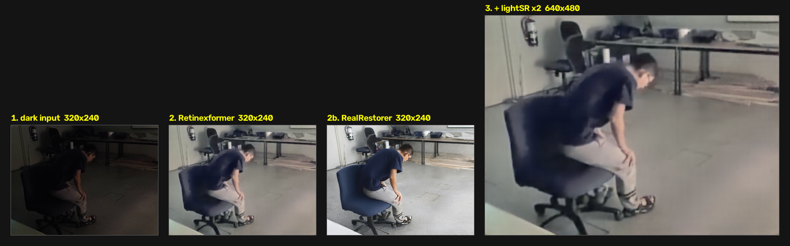
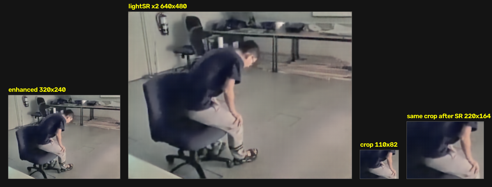
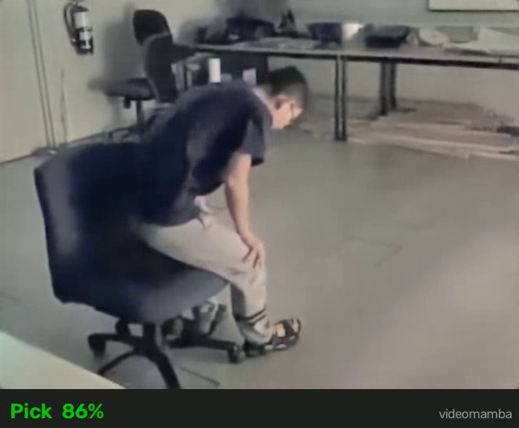
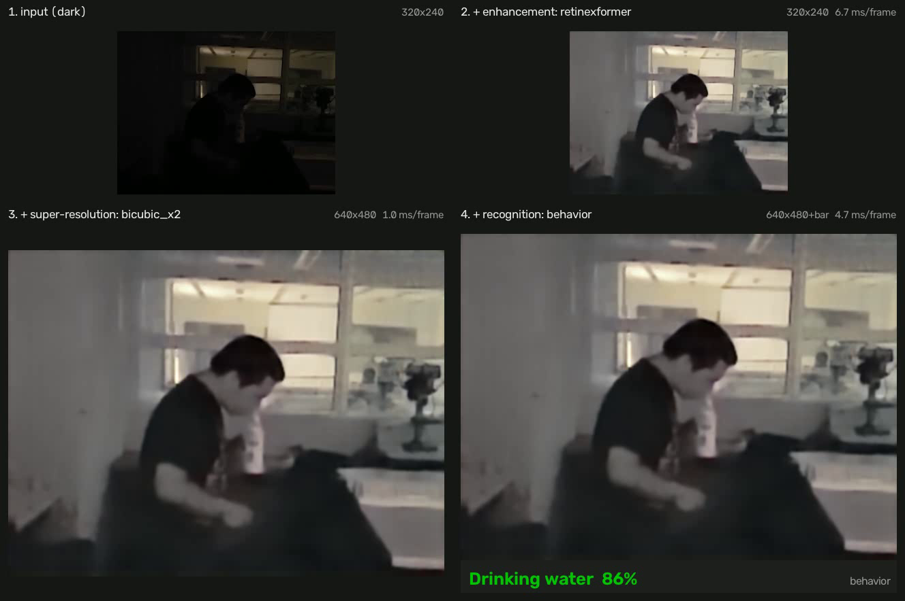
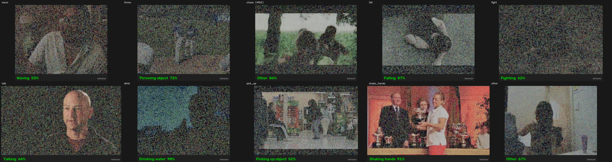
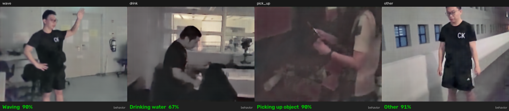

# DarkScenePipeline

The **dark complex scene algorithm** as one deployable project: low-illumination enhancement,
video super-resolution, and human action recognition — each function independently
enable/disable-able and freely combinable — with offline file processing and an online
streaming-inference server.

```
                     ┌───────────────────────────┐
 dark video ──────►  │ 1. low-light enhancement  │   off | retinexformer (NTIRE) | cidnet (HVI-CIDNet) | realrestorer
 (file/RTSP/webcam)  ├───────────────────────────┤
                     │ 2. super-resolution       │   off | bicubic (real-time) | lightsr (MambaIRv2) | catanet (CVPR2025)
                     │    --sr-scale 2 | 3 | 4   │   any input resolution; output is exactly scale x it
                     ├───────────────────────────┤
                     │ 3. action recognition     │   off | r3d | videomamba (ARID-11)
                     │                           │   behavior (9 behaviors + other) | xclip (open vocabulary)
                     └───────────────────────────┘
                       │                    │
              offline: mp4 with the       serve: HTTP MJPEG stream +
              action text BELOW the       SSE recognition events
              frame + events JSON
```

Everything runs in **one uv-managed environment** (Python 3.10, torch 2.7/cu126, prebuilt
mamba CUDA kernels — no local compilation).

## Requirements
- Ubuntu Linux x86_64 with an NVIDIA GPU (driver ≥ 560, i.e. CUDA 12.6 runtime capable).
  ≥ 8 GB VRAM for the standard pipeline; **≥ 24 GB for `--enhance realrestorer`**.
- [uv](https://docs.astral.sh/uv/) (`curl -LsSf https://astral.sh/uv/install.sh | sh`).

## Environment setup
```bash
cd DarkScenePipeline
uv python install 3.10          # uv-managed interpreter (ships C headers triton needs)
UV_MANAGED_PYTHON=1 uv venv --python 3.10 .venv
UV_MANAGED_PYTHON=1 uv sync
# smoke test
.venv/bin/python -c "import torch, mamba_ssm; print(torch.cuda.is_available())"
```
Notes:
- torch 2.7.0 comes from default PyPI wheels (they bundle cu126; no custom index).
- `mamba-ssm` / `causal-conv1d` install from **pinned prebuilt release wheels**
  (`cu12torch2.7cxx11abiTRUE-cp310`, see `[tool.uv.sources]`) — no nvcc needed. If the
  GitHub URLs are slow, prefix them with `https://ghfast.top/`. If they ever disappear,
  fall back to a source build: install `cuda-toolkit` 12.x, then
  `uv pip install --no-build-isolation mamba-ssm causal-conv1d`.
- Use the **uv-managed** Python (as above). A system Python without the `python3.10-dev`
  headers will crash at import time when triton JIT-compiles its launcher.

## Checkpoint preparation
```bash
bash scripts/download_ckpts.sh                  # everything; neural SR weights for x2
bash scripts/download_ckpts.sh --sr-scale 3 --sr-scale 4   # ... plus the x3/x4 SR weights
```
| file (in `ckpts/`) | size | function | provenance |
|---|---|---|---|
| `NTIRE.pth` | 6.2 MB | enhance: retinexformer | Retinexformer model zoo (NTIRE 2025 low-light weight); mirrored on this repo's [v1.0.0 release](https://github.com/ycwfs/DarkScenePipeline/releases/tag/v1.0.0) |
| `CIDNet_generalization.pth` | 7.6 MB | enhance: cidnet | HVI-CIDNet (CVPR2025) LOLv2-syn *generalization* weight ([Fediory/HVI-CIDNet](https://github.com/Fediory/HVI-CIDNet)); stage from a local HVI-CIDNet checkout |
| `mambairv2_lightSR_x{2,3,4}.pth` | 3.9–4.1 MB | sr: lightsr, one per `--sr-scale` | [MambaIR release v1.0](https://github.com/csguoh/MambaIR/releases/tag/v1.0) (use `https://ghfast.top/` prefix for speed) |
| `catanet_x{2,3,4}.pth` | 2.1–2.3 MB | sr: catanet, one per `--sr-scale` | [CATANet release v0.0](https://github.com/EquationWalker/CATANet/releases/tag/v0.0) `x{2,3,4}.pth` (CVPR2025 official weights, unmodified) |
| `r2plus1d_arid.pth` | 120 MB | recognize: r3d | in-house: torchvision R(2+1)D-18 finetuned on NTIRE-enhanced ARID v1.5 split_1 (top-1 0.656 TTA) |
| `videomamba_t_arid_32f.pth` | 27 MB | recognize: videomamba | in-house: VideoMamba-Tiny 32-frame finetuned on enhanced ARID (top-1 0.688 TTA — best) |
| `videomamba_t_behavior_32f.pth` | 27 MB | recognize: behavior | in-house: VideoMamba-Tiny 32-frame trained on the 10-class behavior set (darkened + Retinexformer-enhanced HMDB51 + real-dark ARID; macro-F1 0.569) |
| `xclip-base-patch16-zero-shot/` | 780 MB | recognize: xclip | `microsoft/xclip-base-patch16-zero-shot` HF snapshot (`HF_ENDPOINT=https://hf-mirror.com`) |
| `realrestorer/` | ~39 GiB | enhance: realrestorer | `huggingface-cli download RealRestorer/RealRestorer --local-dir ckpts/realrestorer` (or symlink an existing HF snapshot) |

## Full steps — the recommended configuration
**`--enhance retinexformer --sr bicubic_x2 --recognize behavior`** — all three functions on at
once, and the only such combination that still meets the spec (real-time delay ≤ 1 s, offline
≥ 15 fps) at input sizes up to 640×480.
Enhancement is the NTIRE Retinexformer, super-resolution is real-time ×2,
and recognition is the 9 required behaviors + `other`. Every number below was measured on this
box (RTX 3090, one GPU unless the row says `--gpus`); reproduce them with the commands in
step 5.

**1. Environment** (once) — the full notes are in [Environment setup](#environment-setup):
```bash
cd DarkScenePipeline
uv python install 3.10
UV_MANAGED_PYTHON=1 uv venv --python 3.10 .venv
UV_MANAGED_PYTHON=1 uv sync
.venv/bin/python -c "import torch, mamba_ssm; print(torch.cuda.is_available())"   # -> True
```
`uv sync` also installs this project, which is what creates the `.venv/bin/darkpipe` entry
point. If that file is missing (a venv built with `--no-install-project`, or a sync that
could not reach the mamba wheel URLs), add it without touching the dependency set:
```bash
UV_MANAGED_PYTHON=1 uv pip install --no-deps -e .
```
Everything also works as `.venv/bin/python main.py <same flags>`.

**2. Checkpoints** — this configuration needs **two files, 33 MB total**; `bicubic_x2` has no
weights at all:
```bash
bash scripts/download_ckpts.sh          # stages everything; the two below are the only ones needed here
ls -l ckpts/NTIRE.pth ckpts/videomamba_t_behavior_32f.pth
#  6.2 MB  ckpts/NTIRE.pth                      enhance: retinexformer
# 27   MB  ckpts/videomamba_t_behavior_32f.pth  recognize: behavior
```

**3. Offline processing** — annotated mp4 + events JSON:
```bash
.venv/bin/darkpipe \
  --input dark.mp4 --output out.mp4 --events-json events.json \
  --enhance retinexformer --sr bicubic_x2 --recognize behavior
```
```
[config] mode=offline enhance=retinexformer sr=bicubic_x2 recognize=behavior device=cuda:0
[done] 1042 frames in 42.3s = 24.6 fps -> out.mp4 (1042 frames written)
[done] 64 recognition events; last: Drinking water; majority: Drinking water
```
`out.mp4` is the enhanced video at **2× the input resolution** with a label bar below the
frame; `events.json` carries one entry per prediction (frame index, timestamp, label,
confidence, top-3). For 1280×720 input add `--gpus 0,1,2,3` (one GPU is under the 10 fps floor
there) and see the 720p note in step 5 before promising 15 fps.

**4. Streaming server** — same three stages, live:
```bash
.venv/bin/darkpipe --mode serve --port 8000 \
  --input rtsp://camera/stream \
  --enhance retinexformer --sr bicubic_x2 --recognize behavior
# --input 0 (webcam) and --input file.mp4 (loops) work too
```
| endpoint | what to expect from this configuration |
|---|---|
| `GET /stream` | MJPEG at 2× input size (640×480 in → 1280×960 + label bar), `--max-stream-fps 15` |
| `GET /events` | one SSE JSON per prediction, **~0.7 s apart** (32-frame window, stride 16, at ~25 fps) |
| `GET /health` | `fps_in`, `fps_proc`, `frames_dropped`, **`latency_ms_last`** — the spec number |
| `GET /config` | the resolved configuration, including the serve-mode `reco_span_sec: 1.0` |
```bash
curl -s localhost:8000/health | jq .      # {"fps_in":29.9,"fps_proc":25.0,"latency_ms_last":40.9,...}
curl -N localhost:8000/events             # {"label":"Drinking water","confidence":0.93,...}
firefox http://localhost:8000/stream
```
In serve mode `--reco-span-sec` defaults to **1.0 s**: the 32 frames fed to the recognizer are
resampled from the last second of wall-clock video, so the label always describes the past
≤ 1 s no matter how fast the pipeline runs. Offline it defaults to off (last 32 *processed*
frames), the policy the checkpoint was validated under. When the camera outruns the GPU the
newest frame wins and the drop is counted in `/health` — that is what bounds the latency.

**`--gpus 0,1` works in serve mode too**, and means something different than it does offline:
offline cuts the file into one frame-range per GPU, which needs future frames to exist; a live
stream has none, so serve deals arriving frames round-robin instead. Measured on two 3090s at
`--proc-max-side 840`, 12.9 → **23.8 fps** (1.85×) — but p50 latency 109 → 197 ms, because the
pipeline holds ~6 frames in flight instead of ~2. It buys rate and spends latency; worth it
only while the delay budget is slack. Single-GPU behaviour is unchanged, and a `--gpus` naming
more cards than the box has falls back to it with a warning rather than failing to start.

**5. Measured on this box — and how to reproduce it**
```bash
# offline: 1042 frames of ARID test clips, concatenated at each resolution
.venv/bin/darkpipe --input clip_320x240.mp4 --output /tmp/o.mp4 \
  --enhance retinexformer --sr bicubic_x2 --recognize behavior
# serve: start the server on a looping file, then read /health after ~30 s
curl -s localhost:8000/health | jq '.latency_ms_last, .fps_proc'
timeout 12 curl -sN localhost:8000/events | grep -c '^data:'      # -> 18 events / 12 s
```
| input → output | offline fps (≥ 15 target, ≥ 10 floor) | real-time latency (≤ 1 s) |
|---|---|---|
| 320×240 → 640×480 | **63.7** ✓ | 25–49 ms ✓ |
| **640×480 → 1280×960** | **24.6** ✓ | **41–69 ms** ✓ |
| 640×480, GPU shared with a live serve process | 15.5 ✓ | – |
| 1280×720 → 2560×1440, one GPU | 8.3 ✗ | 125–274 ms ✓ |
| 1280×720 → 2560×1440, `--gpus 0,1,2,3` | 11.5 — floor only | – |

Both spec numbers are met with margin at 640×480 and below: 24.6 fps against a 15 fps target,
41–69 ms against a 1 s budget (15–25× inside it). Row 3 is the caveat worth knowing —
throughput on this box moves by up to 1.5× with machine load, and the worst case measured (a
480p offline job sharing its GPU with a running serve process) still cleared 15 fps.

**1280×720 is the exception, and `--gpus` only half-fixes it.** One GPU gives 8.3 fps, under
the 10 fps floor. Four GPUs give **11.5 fps** — over the floor, still under the 15 fps target.
Sharding scales 2.1× without SR (8.7 → 17.9 fps) but only 1.4× with it, because the ×2 output
makes each worker's host-side path (upscale, label bar, 2560×1440 mp4 encode) heavier and four
workers contend for it; the GPU work per shard is identical either way. So at 720p: drop
`--sr` to clear 15 fps on four GPUs, or keep ×2 output and accept ~11.5 fps. Real-time latency
at 720p is fine on one GPU (serve processes one frame at a time).

**6. Verify the install**
```bash
.venv/bin/python -m pytest tests/ -q            # 66 passed
.venv/bin/python scripts/check_parity.py        # numerical parity gates (needs ckpts + refs)
```
The behavior recognizer emits: `Waving, Throwing object, Chasing, Falling, Fighting, Talking,
Drinking water, Picking up object, Shaking hands, Other`. What that model is, how it was trained
and how well it does per class: [Model specifications](#model-specifications) and
`compare/results/BEHAVIOR_REPORT.md`.

## Usage — offline
```bash
# default pipeline: retinexformer + ARID VideoMamba recognition (SR off — see Performance)
.venv/bin/darkpipe --input dark_clip.mp4 --output out.mp4 --events-json events.json

# the nine required behaviors (waving, throwing, chasing, falling, fighting,
# talking, drinking, picking up, shaking hands) + `other`
.venv/bin/darkpipe --input dark.mp4 --recognize behavior --events-json events.json

# same nine, open-vocabulary — or any other labels, with no retraining
.venv/bin/darkpipe --input dark.mp4 --recognize xclip
.venv/bin/darkpipe --input dark.mp4 --recognize xclip --labels "climbing a fence,loitering"

# 1280x720 at >=15 fps: split the file across four GPUs
.venv/bin/darkpipe --input dark_720p.mp4 --recognize behavior --gpus 0,1,2,3

# enhancement only
.venv/bin/darkpipe --input dark.mp4 --recognize off

# super-resolution, real-time (costs 2-6% throughput; highest PSNR/SSIM on 240p dark video)
.venv/bin/darkpipe --input dark.mp4 --sr bicubic_x2 --recognize behavior
.venv/bin/darkpipe --input dark.mp4 --sr bicubic --sr-scale 4 --recognize behavior   # x3/x4

# super-resolution, learned texture (quality option: ~1.2 fps, short clips only)
.venv/bin/darkpipe --input dark.mp4 --sr catanet_x2      # better quality, faster per frame
.venv/bin/darkpipe --input dark.mp4 --sr lightsr_x2      # 3.2 GiB instead of ~10, faster batched
.venv/bin/darkpipe --input dark.mp4 --sr catanet --sr-scale 3   # needs ckpts/catanet_x3.pth

# best-quality offline restoration (diffusion; ~45 s/frame, short clips only)
.venv/bin/darkpipe --input dark.mp4 --enhance realrestorer --sr off --recognize off --max-frames 16

# recognition only, R(2+1)D-18
.venv/bin/darkpipe --input dark.mp4 --enhance off --sr off --recognize r3d
```
Output: mp4 whose frames are the enhanced (and 2×-upscaled) video with a **label bar below
the frame** showing `Action NN%` (green when confident); `--events-json` writes every
recognition event (frame index, label, confidence, top-3). All three functions off =
passthrough copy (warned).

## Usage — streaming server
```bash
.venv/bin/darkpipe --mode serve --input rtsp://camera/stream --port 8000
# file and webcam sources work too:  --input 0   |   --input demo.mp4  (file loops)
```
| endpoint | content |
|---|---|
| `GET /stream` | annotated video as browser-viewable MJPEG (`multipart/x-mixed-replace`) |
| `GET /events` | recognition results as Server-Sent Events JSON |
| `GET /health` | `fps_in`, `fps_proc`, `frames_dropped`, `latency_ms_last`, reconnects |
| `GET /config` | the active pipeline configuration |
```bash
curl -s localhost:8000/health | jq .
curl -N localhost:8000/events          # live recognition JSON
firefox http://localhost:8000/stream   # or ffplay/VLC
```
When the source is faster than the GPU, the newest frame wins (bounded latency; drops are
counted in `/health`). RealRestorer is rejected in serve mode (offline-only by design).

## Super-resolution factor and input resolution
**`--sr-scale {2,3,4}` works in both modes** — offline (single-GPU and `--gpus`) and serve:
```bash
.venv/bin/darkpipe --input dark.mp4 --sr bicubic --sr-scale 3 --recognize behavior
.venv/bin/darkpipe --input dark.mp4 --sr bicubic --sr-scale 4 --gpus 0,1,2,3
.venv/bin/darkpipe --mode serve --input rtsp://cam --sr bicubic --sr-scale 3 --port 8000
```
`--sr` takes the backend name (`bicubic`/`lightsr`/`catanet`) and `--sr-scale` the factor,
defaulting to 2. The old `--sr bicubic_x2 | lightsr_x2 | catanet_x2` spellings still work and
pin the factor to 2 (combining one with a conflicting `--sr-scale` is an error, not a silent
override). `bicubic` needs no weights at any factor; the two neural backends need the
checkpoint **trained for that factor** — `mambairv2_lightSR_x3.pth`, `catanet_x4.pth`, … —
which `scripts/download_ckpts.sh --sr-scale 3` fetches. Measured, 1042 frames, one RTX 3090:

| input | `--sr-scale` | output | offline fps | serve latency |
|---|---|---|---|---|
| 640×480 | 2 | 1280×960 | **24.9** | 41–69 ms |
| 640×480 | 3 | 1920×1440 | **23.7** | 57–71 ms |
| 640×480 | 4 | 2560×1920 | **19.6** | – |

All three clear the 15 fps target at 640×480: the extra output pixels cost encode time, not
GPU time. The neural backends stay a short-clip quality option at every factor (240p: lightSR
4.2 fps at ×3 and 3.9 at ×4, CATANet 4.0 and 3.5).

**Input resolution is unconstrained** — any size, any aspect ratio, odd or prime dimensions
included. Each network does have an architectural stride (retinexformer 4, CIDNet 8, lightSR
16, CATANet its per-block patch/group sizes), but every stage reflect-pads up to its multiple
and crops the result back, so enhancement returns *exactly* the input size and SR *exactly*
`scale ×` it. The recognizer is size-agnostic by construction: it resizes the short side to
256 and center-crops 224 before the network sees a frame. `tests/test_resolution.py` asserts
this end-to-end at 483×641, 197×353, 98×130, 41×640, 721×1281 and 240×320 — the last two
being larger than any pad multiple and thinner than one recognizer crop respectively.
The one practical limit is throughput, not correctness: cost tracks pixel count, so 1280×720
is the resolution that needs `--gpus` (see Performance).

## Model specifications
Enhance rows measured on a single RTX 4090 at 320×240 input (RealRestorer at size-level
512, 28 steps); **SR and recognizer rows re-measured on the RTX 3090 this release was
benchmarked on**, fp16 forward only (except CATANet — see below), excluding frame
preprocessing. Accuracy: `r3d`/`videomamba` on ARID v1.5 split_1 (11 actions, multi-clip TTA);
`behavior`/`xclip` on the held-out HMDB behavior split, darkened and Retinexformer-enhanced
(10 classes — see `compare/results/BEHAVIOR_REPORT.md`); SR in-domain against enhanced dark
ARID frames (`compare/results/SR_REPORT.md`).

| function | model | params | ms / frame | fps | accuracy |
|---|---|---|---|---|---|
| enhance | Retinexformer (NTIRE) | 1.61 M | ~6 ms | ~168 | – |
| enhance | HVI-CIDNet (generalization) † | 1.98 M | ~30 ms (fp32) | ~33 | – |
| enhance | RealRestorer — official diffusers, `device_map` on 2×24 GB | ≈12.4 B DiT + 8.3 B Qwen2.5-VL + 84 M VAE | ~836,000 ms | 0.0012 | – |
| enhance | RealRestorer — sequential offload, 1×24 GB, single frame | same | ~184,000 ms | 0.005 | – |
| enhance | RealRestorer — sequential offload, 1×24 GB, batched (chunk 8) — *packaged* | same | ~45,000 ms | 0.022 | – |
| SR | bicubic ×2 (`bicubic_x2`) | 0 | **0.6 ms** (CPU) | **~1570** | in-domain **42.92 dB / 0.9903** |
| SR | MambaIRv2 lightSR ×2 (`lightsr_x2`) | 0.77 M | 253 ms | 4.0 | in-domain 39.46 dB / 0.9851 |
| SR | CATANet ×2, CVPR2025 (`catanet_x2`) | **0.48 M** | **188 ms** (fp32) | 5.3 | in-domain **39.56 dB / 0.9852** |
| recognize | R(2+1)D-18 (`r3d`) | 31.31 M | 12.1 ms / 16-frame clip | 82.5 clips/s | ARID top-1 0.656 / top-5 0.947 |
| recognize | VideoMamba-T 32f (`videomamba`) | 6.96 M | 55.1 ms / 32-frame clip | 18.1 clips/s | ARID top-1 0.688 / top-5 0.911 |
| recognize | VideoMamba-T 32f, 10 behaviors (`behavior`) | 6.96 M | 55.0 ms / 32-frame clip | 18.2 clips/s | top-1 0.671 / **macro-F1 0.569** |
| recognize | X-CLIP-B/16 zero-shot, open vocabulary (`xclip`) | 194.94 M | 43.9 ms / 32-frame clip | 22.8 clips/s | top-1 0.489 / macro-F1 0.261 (0.696 / 0.534 domain-adapted) |

X-CLIP is 28× the parameters of VideoMamba-T and still the faster of the two per clip: a
ViT-B/16 at T=32 is dense matmul on tensor cores, while VideoMamba's selective scan is
sequential along the token axis. Parameter count is not the cost model here.

CATANet runs **fp32**: its autocast self-check measures 40–42 dB against the fp32 reference,
under the 45 dB gate, so the stage falls back and says so at load. It costs ~2%, because the
work is memory-bound token clustering rather than matmul. The three SR rows are batch 1 on
320×240 input — ×2 to 640×480, what serve mode does — measured in one run so they compare;
batched, the two networks come within 3% of each other and bicubic gets slightly *worse* per
frame (it is serial CPU work with nothing to amortize). See `compare/results/SR_REPORT.md` §3.

The bicubic row is not a placeholder: on this footage it is *also* the quality winner. The
input is 240p enhanced dark video, so after the protocol's /2 there is little true
high-frequency detail left to recover, and both networks spend capacity synthesizing texture
onto amplified sensor noise — which reads as sharper but scores lower on PSNR/SSIM. What
they offer over bicubic is perceptual detail, not fidelity, and on true high-resolution
sensor input the ranking would be expected to invert.

## Visual samples (native pixel sizes — no display resizing)
Stage progression on a dark ARID frame; panel sizes are the REAL output sizes, so the
super-resolution step is physically 2× larger:



Super-resolution true-size comparison, with the same region cropped at native pixels
(110×82 before vs 220×164 after ×2 SR):



Final pipeline output frame (enhanced + ×2 SR + recognition text below the frame):



### Stage-by-stage video
`compare/stage_video.py` writes **one video per pipeline step** plus a 2×2 grid of all four,
from the real stage objects in the shipped order (enhance → recognizer tap → SR → label bar,
exactly as `pipeline.py:process_chunk` runs them). Panels are at native pixel size, so the
SR row is physically twice the input row; captions carry the true size and the measured
steady-state ms/frame:



```bash
.venv/bin/python ../compare/stage_video.py \
    --input <dark.mp4> --enhance retinexformer --sr bicubic_x2 --recognize behavior
# -> compare/results/stage_video/*_{1_input,2_enhance,3_sr,4_recognition,grid}.mp4
```
On the ARID `Drink_11_1` clip (94 frames, 320×240, RTX 3090) it reports enhancement at
6.7 ms/frame, bicubic ×2 at 1.0 ms/frame and recognition at 4.7 ms/frame amortised over every
frame — 12.4 ms of stage work per frame, the rest of the offline budget being decode, label
rendering and mp4 encode. Two cold starts are excluded from that average: the first chunk,
and the recognizer's first forward (mamba kernel compilation, ~2 s). The second one is why
this 94-frame clip measures 20.3 fps end-to-end while the 150-frame benchmark reports 28.0
fps for the same configuration — on short clips the compile never amortises.

### One video per behavior class
`compare/behavior/class_video.py` renders that same four-stage grid **once per behavior**, so
the reel shows all ten labels rather than one clip. Source clips are the HMDB test split,
darkened by the calibrated simulation each clip was trained at (`exposure k` is printed in the
banner because it varies ~20× between clips and explains why some panels are far noisier than
others). Every frame carries the true class, the predicted one and an OK/MISS flag:



```bash
.venv/bin/python ../compare/behavior/class_video.py --enhance retinexformer \
    --sr bicubic_x2 --recognize behavior --pick correct --tries 6
# -> compare/results/class_video/class_<behavior>_behavior.mp4  (10 videos)
#    + class_contact_behavior.png (above) + class_index_behavior.json
```
`--pick first` takes the sorted-first test clip per class and gets **7/10** right; the default
`--pick correct` searches up to `--tries` clips for one the recognizer labels correctly and
reaches **9/10**, `chase` failing on all six candidates. Neither number is an accuracy figure —
ten clips, one per class, chosen with knowledge of the answer in the default mode. The
measured numbers are in `compare/results/BEHAVIOR_REPORT.md`; this reel exists to be watched.

Those panels look speckled because their darkness is **simulated**. `--source arid` renders the
same grid from genuinely dark ARID footage — only drink / pick_up / wave / other, the whole
overlap with ARID-11, but on those four it scores 4/4 at 0.85–0.91 confidence and the enhanced
frames are clean:



```bash
.venv/bin/python ../compare/behavior/class_video.py --source arid
```
The two reels are never mixed in one sheet. The reason the simulated one is noisier is not that
it is darker — the real `pick_up` clip is darker still — but that the simulation's shot noise
was never calibrated against a real sensor's SNR, so it carries ~8× the per-pixel noise, which
the enhancer then amplifies 6–11×. `BEHAVIOR_REPORT.md` §2.2 and §3.5 have the measurements;
the practical consequence is that every simulated-dark number in this repo is **pessimistic**.

For the six classes ARID does not cover, two flags make the HMDB reel presentable:

```bash
--full-well 30000        # simulate a realistic sensor: the enhancer runs for real and its
                         # output is clean (enhanced noise 2.1-6.0, ARID's own range is 1.9-2.9)
--enhance-panel original # bright source in the enhancement slot: SR + recognition run on it,
                         # panel 2 captioned "original source (enhancer NOT run)"
```
`--full-well 30000` is the one to show, because the enhancement in it is genuine — it fixes the
*input*, not the picture. `--enhance-panel original` is an enhancement-perfect upper bound and
labels itself as one on every frame.

## Model selection guide
- **retinexformer** (default): 1.6 M params, ~6 ms/frame — the real-time enhancer.
- **cidnet**: HVI-CIDNet (CVPR2025), 2.0 M params, ~30 ms/frame fp32 — higher-fidelity
  low-light enhancement (beats Retinexformer on LOLv2 PSNR/SSIM/LPIPS with dataset-matched
  weights). Its HVI color-space transform runs fp32, so it is slower than Retinexformer but
  still real-time. Ships the *generalization* weight for best behaviour on arbitrary dark video.
  († enhance ms/frame measured on RTX 3090; other rows RTX 4090.)
- **realrestorer**: 12.4 B-param diffusion restorer conditioned on Qwen2.5-VL. Far higher
  visual quality on stills, ~45 s/frame with batched sequential offload on one 24 GB GPU.
  Offline keyframes/short clips only. Caution: on inputs with almost no signal it
  *hallucinates plausible detail* — superb for display, not evidence-preserving.
- **videomamba** (default): 7 M params, 55 ms/clip, ARID top-1 0.688 — the better ARID-11
  recognizer.
- **r3d**: 31 M params, 12 ms/clip, ARID top-1 0.656 — the conservative baseline, and the
  cheapest recognizer by a wide margin.
- **behavior**: the same VideoMamba-T retrained on the 10-way behavior set (waving, throwing,
  chasing, falling, fighting, talking, drinking, picking up, shaking hands, `other`). Best
  macro-F1 of the four (0.569); use it when the nine behaviors are the whole requirement.
- **xclip**: X-CLIP-B/16, open vocabulary — `--labels "climbing a fence,loitering"` recognizes
  anything nameable with no retraining, and it is the only option that covers `chase` without
  weak-labelled training data. Zero-shot macro-F1 is 0.261, so it trades accuracy for
  flexibility; `--xclip-reject-tau` (default 0.4, calibrated on validation) is what keeps it
  from forcing ordinary footage into one of the nine.
- **bicubic** — the only backend that meets the performance spec, and the one to use
  unless you specifically want learned texture. 0.6–2 ms/frame of CPU `cv2.INTER_CUBIC`: 2–6%
  end-to-end cost, no weights at any `--sr-scale`, no VRAM, and the only `--sr` that runs on
  `--device cpu`. It also scores the highest in-domain PSNR/SSIM of the three (42.92 dB /
  0.9903), and it is the only one whose ×3/×4 cost stays inside the 15 fps target at 640×480.
- **catanet_x2**: CATANet (CVPR2025), 0.48 M params — the better *neural* ×2 backend. Higher in-domain
  PSNR/SSIM than lightSR on both test sets, 24–26% faster at batch 1, and the only SR
  configuration that holds real-time latency under 1 s at 640×480 (825–903 ms vs 1082–1123).
  Costs ~10 GiB per 640×480 frame, hence `--sr-chunk` defaults to 1 for it.
- **lightsr_x2**: MambaIRv2 lightSR, 0.77 M params — keep it for a small card (3.2 GiB) or
  for batched offline work, where chunk-4 (730 ms/frame) beats CATANet's chunk-1 (771 ms).
- Neither *neural* SR backend reaches the 10 fps offline floor, which is why `--sr` still
  defaults to `off` and why `bicubic` exists. Full comparison:
  `compare/results/SR_REPORT.md`. Both accept `--sr-scale 3`/`4` with the matching
  per-factor checkpoint; the ×2 quality numbers above do not transfer to those factors,
  which were not benchmarked (the CLI says so in a warning).
- Recognition consumes **post-enhance, pre-SR** frames (the trained checkpoints saw enhanced
  frames; SR was measured recognition-neutral, so it stays out of the decision path).

## Performance
Measured on **one RTX 3090**, 300-frame clips, via `compare/behavior/bench_pipeline.py`.
Offline fps is the shipped CLI's own steady-state rate; real-time latency is serve mode's
`/health.latency_ms_last`, timed from frame capture to encoded output.

| resolution | configuration | offline fps | real-time latency |
|---|---|---|---|
| 320×240 | enhance only | 73.5 | 24 ms |
| 320×240 | enhance + recognize | 36.8–84.1 | 23–31 ms |
| **640×480** | enhance only | 27.1 | 31 ms |
| **640×480** | retinexformer + `r3d` | **26.7** | 40 ms |
| **640×480** | retinexformer + `videomamba` | **21.6** | 32 ms |
| **640×480** | retinexformer + `behavior` | **21.4** | 33 ms |
| **640×480** | retinexformer + `xclip` | **25.8** | 45 ms |
| **640×480** | cidnet + `behavior` | **19.4** | 97 ms |
| 1280×720 | retinexformer + recognize, 1 GPU | 6.8–8.8 | 111–273 ms |
| 1280×720 | retinexformer + recognize, `--gpus 0,1,2,3` | **16.4** | – |
| 320×240 | + `--sr bicubic_x2` ‡ | **24.4–45.3** | 25–49 ms |
| **640×480** | + `--sr bicubic_x2` ‡ | **14.8–21.7** | 44–98 ms |
| 1280×720 | + `--sr bicubic_x2` ‡ | 5.8–7.7 | 125–274 ms |
| **640×480** | + `--sr bicubic --sr-scale 3` § | **23.7** | 57–71 ms |
| **640×480** | + `--sr bicubic --sr-scale 4` § | **19.6** | – |
| 320×240 | + `--sr catanet_x2` | 3.9–5.1 | 222–240 ms |
| 320×240 | + `--sr lightsr_x2` | 4.1–5.5 | 274–292 ms |
| 640×480 | + `--sr catanet_x2` | 1.1–1.2 | **825–903 ms** |
| 640×480 | + `--sr lightsr_x2` | 1.0–1.2 | 1082–1123 ms |
| any | `--enhance realrestorer` | 1/45 | 45 s |

§ The `--sr-scale` rows are a separate 1042-frame run of the recommended configuration
(`retinexformer + bicubic + behavior`) measured back to back at ×2/×3/×4 — 24.9 / 23.7 /
19.6 fps — so they are comparable to each other, not to the ‡ rows above.

‡ The bicubic rows come from one paired 150-frame run (`behavior_perf_bicubic2.json`) that
measured SR-off and SR-on back to back. That matters: absolute fps on this box moves by up to
1.5× with machine load between sessions (`retinexformer + behavior` at 640×480 measured 21.4
one day and 17.4 the next), so the **cost of a stage is only meaningful inside one run**:

| resolution | configuration | `--sr off` | `--sr bicubic_x2` | cost |
|---|---|---|---|---|
| 320×240 | retinexformer, no recognizer | 47.0 | 45.3 | −3.6% |
| 320×240 | retinexformer + `behavior` | 29.2 | 28.0 | −4.1% |
| 320×240 | cidnet + `behavior` | 25.5 | 24.4 | −4.3% |
| **640×480** | retinexformer, no recognizer | 22.2 | 21.7 | −2.3% |
| **640×480** | retinexformer + `behavior` | 17.4 | 16.3 | −6.3% |
| **640×480** | cidnet + `behavior` | 15.4 | 14.8 | −3.9% |
| 1280×720 | retinexformer, no recognizer | 8.1 | 7.7 | −4.9% |
| 1280×720 | retinexformer + `behavior` | 7.1 | 6.5 | −8.5% |
| 1280×720 | cidnet + `behavior` | 6.2 | 5.8 | −6.5% |

**Spec compliance — real-time delay ≤ 1 s, offline ≥ 15 fps (floor 10 fps):**

- **Met at every resolution up to 640×480**, for both enhancers and all four recognizers. The
  slowest shipped configuration (CIDNet + `behavior` at 640×480) runs 19.4 fps against a
  15 fps target and 97 ms against a 1 s budget. The recognizer is never the bottleneck —
  turning it off buys 21.4 → 27.1 fps, while the enhancer alone is 29 of the 37 ms per frame.
- **1280×720 needs more than one GPU.** A single 3090 manages 6.8–9.1 fps there — under the
  10 fps floor. `--gpus 0,1,2,3` splits the file into contiguous frame ranges, runs the normal
  offline path on each and concatenates: **16.4 fps measured** on a 900-frame 720p clip, above
  the 15 fps target. That figure is end-to-end and includes per-worker model load, so it is
  the conservative one. Cost of the split: the recognition window restarts at each seam, so a
  4-way split emitted 52 events where the single-GPU run emitted 55. Real-time latency at
  720p is fine on one GPU (111–273 ms) — serve keeps one frame per stage rather than batching,
  so latency tracks a single frame's cost, not the file's. Serve accepts `--gpus` as well, but
  round-robins live frames instead of sharding (see step 4): it lifts rate and costs latency,
  the opposite trade from the offline split, which lifts rate at no latency cost at all.
- **With `--sr bicubic_x2`, super-resolution is inside the spec too.** It costs 2–6% of
  throughput and 2–18 ms of latency, so ×2 output holds ≥ 15 fps at 320×240 (24.4–45.3) and
  at 640×480 for every configuration except CIDNet + `behavior`, which lands at 14.8 fps —
  0.2 under the target, comfortably over the 10 fps floor. Latency is 25–274 ms across all
  three resolutions, i.e. 4–40× inside the 1 s budget. **720p ×2 is the one case `--gpus` does
  not fully rescue**: 8.3 fps on one GPU and 11.5 fps on four (965-frame clip) — over the
  10 fps floor, under the 15 fps target. The same 4-GPU split reaches 17.9 fps with `--sr off`,
  so sharding scales 2.1× without SR and only 1.4× with it: GPU work per shard is identical, but
  the ×2 output triples each worker's host-side cost (upscale, label bar, 2560×1440 mp4 encode
  — 34 fps single-threaded, against 142 fps at 1280×720) and four workers contend for it.
- **Neither *neural* `--sr` backend meets the offline half of the spec, and `--sr` still
  defaults to `off`.** Both sit at 1.0–1.2 fps at 640×480 — roughly 9× under the 10 fps floor
  — and no precision/chunk sweep moved either by more than ~30% (lightSR: chunk 1/2/4 →
  0.90/1.10/1.20 fps). Sharding does not rescue it either: 4× of 1.2 fps is still under the
  floor. They are offline quality options for short clips, and selecting one prints a warning
  naming its measured rate.
- **On real-time latency, `catanet_x2` is the only neural backend inside the budget.** At
  640×480 it delivers 825–903 ms capture-to-output, where `lightsr_x2` measures 1082–1123 ms
  and is the one configuration in the project that breaches 1 s. CATANet's margin is 10–18%,
  so 720p with neural SR is not offered; both are comfortable at 320×240 (222–292 ms).
  Details and the quality comparison: `compare/results/SR_REPORT.md`.
- **`--enhance realrestorer` is offline-only by design** and is rejected in serve mode.

Robustness fixes that came out of this benchmark: a stage OOM used to *hang* the offline run
(the decode thread blocked on a bounded queue that nothing was draining) instead of raising —
now it aborts with the real exception, asserted by a test with a join timeout; and enhance/SR/
recognition share one helper that halves the batch on `OutOfMemoryError`, which is what makes
720p run at all (the default enhance chunk of 32 needs 2.2 GiB per batch there).

## Architecture notes
- `darkpipe/vendor/` carries the model code so no external repos are needed at runtime:
  - `retinexformer_arch.py` — verbatim from Retinexformer (self-contained).
  - `mambairv2light_arch.py` — MambaIR arch with its basicsr couplings removed; runs
    against PyPI mamba-ssm (API-identical `selective_scan_fn`).
  - `catanet_arch.py` — CATANet (CVPR2025) with its two basicsr couplings removed
    (`ARCH_REGISTRY` decorator dropped, `trunc_normal_` taken from `torch.nn.init`);
    bit-exact against the original, max|Δ| = 0.00e+00.
  - `videomamba/` — VideoMamba-Tiny with the fork's private fused op replaced by
    `bimamba_interface.py`, a thin wrapper over PyPI public kernels (logits-parity verified,
    max|Δ| ≈ 2e-4).
  - `realrestorer/` — the ComfyUI-RealRestorer reimplementation (SDPA-only) + a batched
    4-phase sequential-offload runner (never keeps Qwen-7B and the DiT resident together;
    streams DiT blocks from CPU with partial residency).
- SR invariants (the two neural backends): fp32 weights + fp16 autocast (`.half()` breaks
  lightSR's norm layers) and a PSNR self-check at load with fp32 fallback — which CATANet
  trips (40–42 dB) and lightSR passes. lightSR additionally needs a fixed torch seed per
  forward, because its arch uses gumbel-softmax routing *at eval time*; CATANet's token
  centers are frozen buffers, so it is deterministic without one. `bicubic_x2` shares the
  `FrameStage` contract and nothing else: no weights, no device, no batching — which is why
  it is the only `--sr` that config validation allows on `--device cpu`.
- Every vendored model passed numerical parity gates against the original environments
  (`scripts/check_parity.py`; enhancement 68.5 dB, SR 73.2 dB, recognizer logits argmax-equal).

## Troubleshooting
- `Python.h: No such file or directory` at first import → you used a system Python without
  dev headers; recreate the venv with `UV_MANAGED_PYTHON=1` (see Environment setup).
- mamba wheel URL 404 → check the release pages for the `cu12torch2.7cxx11abiTRUE-cp310`
  asset of a newer version, or use the source-build fallback above.
- `numpy` ABI errors → keep `numpy>=2.0,<2.1` (pinned; do not upgrade past 2.1).
- Output mp4 will not play in a browser / 微信 → check `ffprobe -show_entries stream=codec_name`.
  It must say `h264`. `mpeg4`/`FMP4` means the ffmpeg binary was missing and `VideoWriter`
  fell back to cv2, whose bundled encoder set has no usable H.264 (see the WARNING in the log).
- RTSP drops/reconnects → watch `reconnects` in `/health`; capture retries with backoff.
- Everything about checkpoints → `scripts/download_ckpts.sh` prints what is missing.

## Tests & verification
```bash
.venv/bin/python -m pytest tests/ -q          # imports, CLI validation matrix, label bar,
                                              # arbitrary input resolution (66 passed)
.venv/bin/python scripts/check_parity.py      # numerical parity gates (needs ckpts + refs)
```
